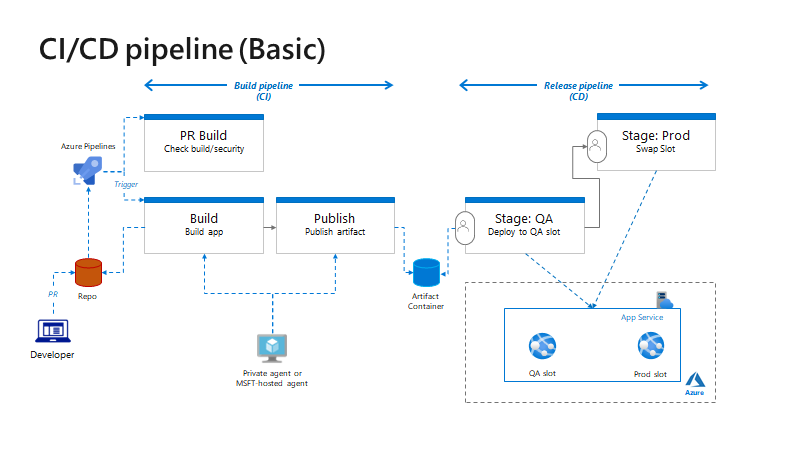

# Sample dotnet code for DevOps HoL (Basic)



## Local build & test

Build and run

```
dotnet build
dotnet run
```

Test

```
curl http;//localhost:5000
```

Publish app

```
dotnet publish -c Release -o out
```

## Pipeline samples

- pipeline using MSFT-hosted agent: [_build-pipeline.yml](./pipelines/_build-pipeline.yml)
- pipeline using self-hosted agent: [_build-pipeline_private.yml](./pipelines/_build-pipeline_private.yml)
